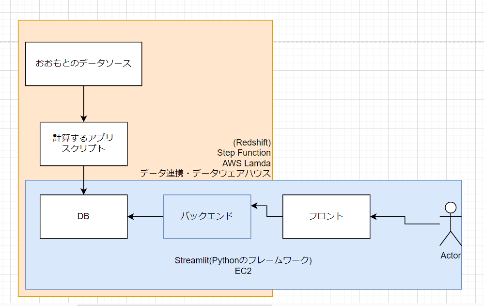

# 技術のリサーチとデータの流れ

- [技術のリサーチとデータの流れ](#技術のリサーチとデータの流れ)
  - [金融アプリへの適用](#金融アプリへの適用)
    - [1. データ収集](#1-データ収集)
    - [2. データ処理](#2-データ処理)
    - [3. データ保存](#3-データ保存)
      - [S3 vs Redshift](#s3-vs-redshift)
    - [4. データ分析](#4-データ分析)
    - [5. 分析結果の表示](#5-分析結果の表示)
    - [6. ホスティング](#6-ホスティング)
  - [ワークフロー](#ワークフロー)



**データ連携**:

異なるシステムやアプリケーション間でデータを交換し，統合するプロセス．

データの一貫性と整合性が保たれ，ビジネスプロセスの効率化が図れる．

**データウェアハウス**:

大量のデータを集約し，分析するための中央リポジトリ(保管庫)．

BI ツールと連携して，意思決定を支援するための洞察を提供．

|      | ベース     | ウェアハウス | レイク |
| ---- | ---------- | ------------ | ------ |
| 用途 | データ処理 | 分析         | 保存   |
| 形式 | 構造化     | 構造化       | 未定義 |

## 金融アプリへの適用

1. データ収集
2. データ処理
3. データ保存
4. データ分析
5. 分析結果の表示
6. ホスティング

### 1. データ収集

[AWS Lambda](https://aws.amazon.com/lambda/) を使用して，リアルタイムでデータを取得

1. Lambda 関数を作成

   yfinance から情報を取得し S3 に保存する関数等．

2. 必要なライブラリをパッケージング．
3. Lambda 関数を記述した zip ファイルをアップロード．
4. Lambda 関数の実行

   - トリガーの設定

     - [Amazon CloudWatch](https://aws.amazon.com/cloudwatch/) で毎日定時にデータを収集など．

   - 関数のテスト

---

### 2. データ処理

S3 に保存したデータを [AWS Glue](https://aws.amazon.com/glue/) を使用して ETL 処理を行う．

Glue: ETL(抽出(Extract), 変換(Transform), ロード(Load))処理を行うためのサービス．

---

### 3. データ保存

[Amazon Redshift](https://aws.amazon.com/redshift/)にクレンジングおよび変換されたデータを保存．

Redshift: フルマネージド型データウェアハウス．

- フルマネージド: インフラ管理が不要．
- データウェアハウス: データを集約し、分析するための中央リポジトリ．

#### S3 vs Redshift

- S3: 高いコスト効率．
- Redshift: 高速なクエリ性能．

|          | S3                             | Redshift                   |
| -------- | ------------------------------ | -------------------------- |
| コスト   | 低コスト                       | 高？                       |
| アクセス | ファイル単位                   | クエリ                     |
| 分類     | オブジェクトストレージサービス | データウェアハウスサービス |

---

### 4. データ分析

- **Redshift**に保存されたデータを pandas に渡して計算．

  - `conn = psycopg2.connect()` で Redshift に接続．
  - `query = "SELECT ..."` で SQL クエリを実行．
  - `pd.read_sql(query, conn)` でデータを取得．
  - `conn.close()`で接続を閉じる．
  - 計算の実行．

---

### 5. 分析結果の表示

- **Streamlit**を使用して，分析結果をブラウザに表示．

  - [Streamlit](https://streamlit.io/)

    - Python コードだけでブラウザに表示できる．
    - ブラウザ上で操作できる．
    - `st.bar_chart(df)` で棒グラフを表示．
    - `streamlit run script.py` でアプリを起動．

---

### 6. ホスティング

[Amazon EC2](https://aws.amazon.com/ec2/) で Streamlit アプリをホストする．

EC2: Elastic Compute Cloud.

---

## ワークフロー

[AWS Step Functions](https://aws.amazon.com/step-functions/)を使用して，以上の流れを管理する．

ワークフロー定義の例 by GPT 4o:

```json
{
  "Comment": "ETL and Analysis Workflow",
  "StartAt": "CollectData",
  "States": {
    // データを集める
    "CollectData": {
      "Type": "Task",
      "Resource": "arn:aws:lambda:region:account-id:function:CollectDataFunction",
      "Next": "ProcessDataWithGlue"
    },
    // データを処理する
    "ProcessDataWithGlue": {
      "Type": "Task",
      "Resource": "arn:aws:states:region:account-id:activity:GlueJob",
      "Next": "LoadDataToRedshift"
    },
    // データを Redshift に保存する
    "LoadDataToRedshift": {
      "Type": "Task",
      "Resource": "arn:aws:lambda:region:account-id:function:LoadDataToRedshiftFunction",
      "Next": "FetchDataWithPandas"
    },
    // pandas にデータを渡す
    "FetchDataWithPandas": {
      "Type": "Task",
      "Resource": "arn:aws:lambda:region:account-id:function:FetchDataWithPandasFunction",
      "Next": "AnalyzeWithPyMC"
    },
    // データ分析を行う
    "AnalyzeWithPyMC": {
      "Type": "Task",
      "Resource": "arn:aws:lambda:region:account-id:function:AnalyzeWithPyMCFunction",
      "Next": "DisplayWithStreamlit"
    },
    // 結果を表示する
    "DisplayWithStreamlit": {
      "Type": "Task",
      "Resource": "arn:aws:lambda:region:account-id:function:DisplayWithStreamlitFunction",
      "End": true
    }
  }
}
```
