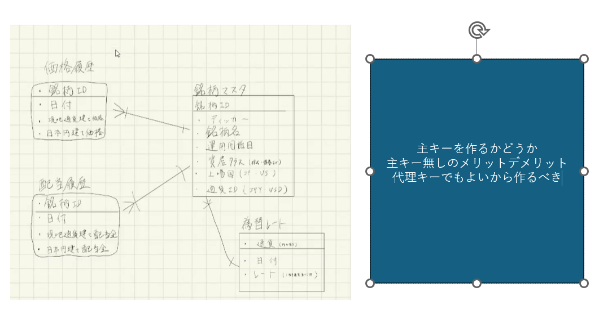
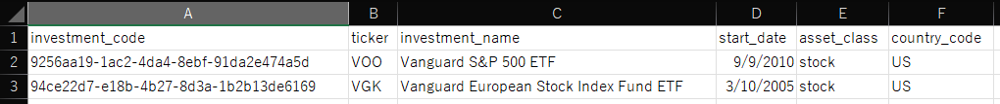
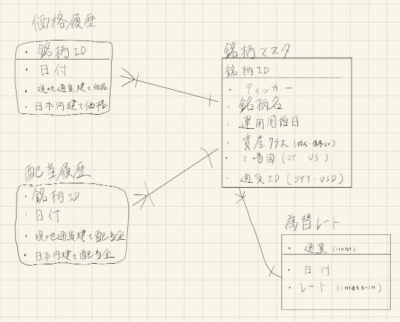
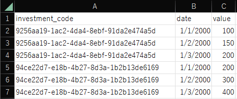
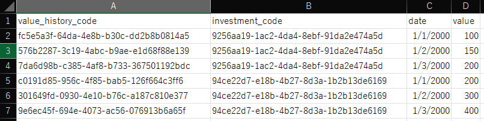

# 2025-02-26 定例会

## 開発の進め方

開発用 RDS を立てて作業し，本番ではそのテーブルを消し，本番用のテーブルを作成する．

関数と業務ロジックを分ける．

全体を try-catch で囲む．

データベースへの接続は try．接続の遮断は finally．

## DB の履歴データの主キー

## 銘柄マスタ

## 佐藤さんへ

内定者の穐谷(あきや)です。

先日の研修ではデータベースについてご教授いただき、ありがとうございました。
研修を通じて、おそらく自分は DB が好きだと感じたので、今後は DB の知識を深めたいと思います。

つきましては「主キー無しの運用」と「サロゲートキーの運用」の選択について、ご意見をいただきたく存じます。

現在、有価証券( ETF や投資信託など) のデータからリターンとリスクを計算する Web アプリを開発しています。

その DB 設計について、価格履歴テーブルと配当履歴テーブル，為替レートテーブルの最適な構造について検討しているところです。ご経験豊富な佐藤さんのアドバイスをいただければ幸いです。

手書きで恐縮ですが、現在検討中の ER 図を添付いたします。

銘柄マスタに投資する銘柄の情報が格納されており、価格履歴テーブルと配当履歴テーブルは銘柄 ID (`investment_code`) を外部キーとして関連付けられています。

為替レートテーブルは、銘柄マスタと通貨 ID で関連付けられています。

3 つの構造は類似しているため、価格履歴テーブルを例に説明いたします。

価格履歴テーブルは、外部キーである銘柄マスタの主キー (`investment_code`) と 日付 (`date`) によって、各レコードを一意に特定できます。

しかし、日付を主キーにするのは好ましくないということで、2 つの案を検討しております。

1. 主キー無し
2. サロゲートキー

1 の主キー無しは以下ような構造です。

リターン等を計算する際は、選んだ銘柄の全履歴データを利用するため、単一レコードの参照ケースは想定していません。そのため、主キーが無くても運用上の問題はないと考えています。

ただし、基本情報技術者試験では主キーが無いテーブル設計について学習しなかったため、適切かどうかわかりません。

2 のサロゲートキーはこのような構造です。

1 の主キー無しの運用が不適切であれば、`value_history_code` を主キーとして設定する方針です。

価格履歴テーブルのような日次データが複数系列ある場合、どちらの構造が通例使われるものなのでしょうか？

それぞれの構造について、メリット・デメリットがあれば教えていただけると幸いです。

どうぞよろしくお願いいたします。

穐谷
