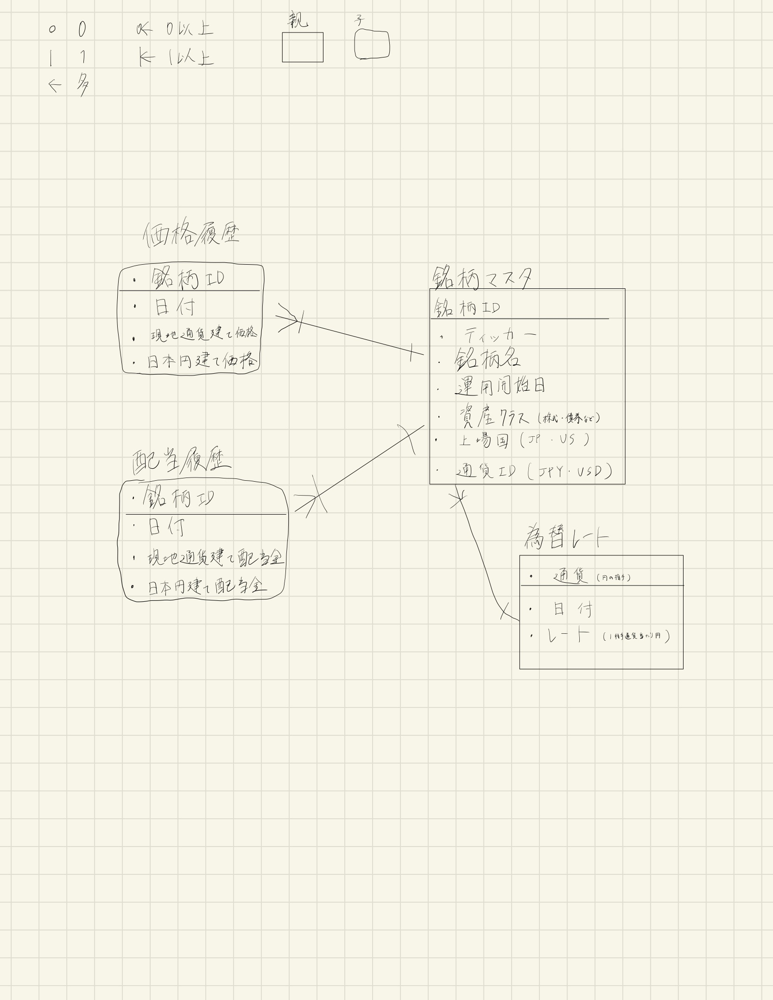

# DB 設計

## ER 図

## テーブル一覧

| No. | テーブル名      | 種別             | 備考           |
| --- | --------------- | ---------------- | -------------- |
| 1   | investment_info | マスタ           | 銘柄情報       |
| 2   | price           | トランザクション | 価格履歴       |
| 3   | dividend        | トランザクション | 配当履歴       |
| 4   | exchange_rate   | トランザクション | 為替レート履歴 |

## 投資銘柄情報テーブル

| No. | カラム名        | 型          | 制約        | 備考                                                 |
| --- | --------------- | ----------- | ----------- | ---------------------------------------------------- |
| 1   | investment_id   | serial      | PRIMARY KEY | 投資銘柄 ID                                          |
| 2   | ticker          | varchar(7)  | NOT NULL    | `yfinance` 用のティッカー                            |
| 3   | investment_name | varchar(50) | NOT NULL    | 名前                                                 |
| 4   | start_date      | date        | NOT NULL    | 運用開始日                                           |
| 5   | asset_class_id  | serial      | NOT NULL    | 資産クラス 例: 株式，債券，複合                   |
| 6   | country_id      | char(2)     | NOT NULL    | 2 文字の国コード ISO 3166-1 alpha-2 例: JP，US |
| 7   | currency_id     | char(3)     | FOREIGN KEY | 3 文字の通貨コード (ISO 4217)                        |

## 価格履歴テーブル

| No. | カラム名      | 型            | 制約        | 備考                                                      |
| --- | ------------- | ------------- | ----------- | --------------------------------------------------------- |
| 1   | investment_id | serial        | PRIMARY KEY | 投資銘柄 ID                                               |
| 2   | date          | date          | NOT NULL    | 日付                                                      |
| 3   | price_local   | numeric[8, 2] | NOT NULL    | 現地通貨建て価格 精度 8 スケール 2 最大 99999.99 |
| 4   | price_jpy     | numeric[8, 2] | NOT NULL    | 日本円建て価格 精度 8 スケール 2 最大 99999.99   |

## 配当履歴テーブル

| No. | カラム名       | 型            | 制約        | 備考                                                                    |
| --- | -------------- | ------------- | ----------- | ----------------------------------------------------------------------- |
| 1   | investment_id  | serial        | PRIMARY KEY | 投資銘柄 ID                                                             |
| 2   | date           | date          | NOT NULL    | 日付                                                                    |
| 3   | dividend_local | numeric[7, 2] | NOT NULL    | 現地通貨建て 1 株当たり配当金額 精度 7 スケール 2 最大 9999.99 |
| 4   | dividend_jpy   | numeric[7, 2] | NOT NULL    | 日本円建て 1 株当たり配当金額 精度 7 スケール 2 最大 9999.99   |

## 為替レートテーブル

1 相手通貨あたり何円か

| No. | カラム名      | 型            | 制約        | 備考                                                                             |
| --- | ------------- | ------------- | ----------- | -------------------------------------------------------------------------------- |
| 1   | currency_id   | char(3)       | PRIMARY KEY | 3 文字の通貨コード (ISO 4217) 例: JPY，USD                                    |
| 2   | date          | date          | NOT NULL    | 日付                                                                             |
| 3   | exchange_rate | numeric[6, 2] | NOT NULL    | 1 相手通貨当たり日本円 精度 6 スケール 2 最大 999.99 ※JPY なら全て 1 |

## 参考文献

[厚生労働省「シームレスな健康情報活用基盤実証事業」地域連携システム テーブル定義書](!https://www.mhlw.go.jp/seisakunitsuite/bunya/kenkou_iryou/iryou/johoka/johokatsuyou/dl/tenpu03_06.pdf)

[PostgreSQL 9.4.5 文書 第 8 章 データ型](!https://www.postgresql.jp/docs/9.4/datatype.html)

[国別通貨コード一覧 (ISO 4217)](!https://www.iban.jp/currency-codes)
