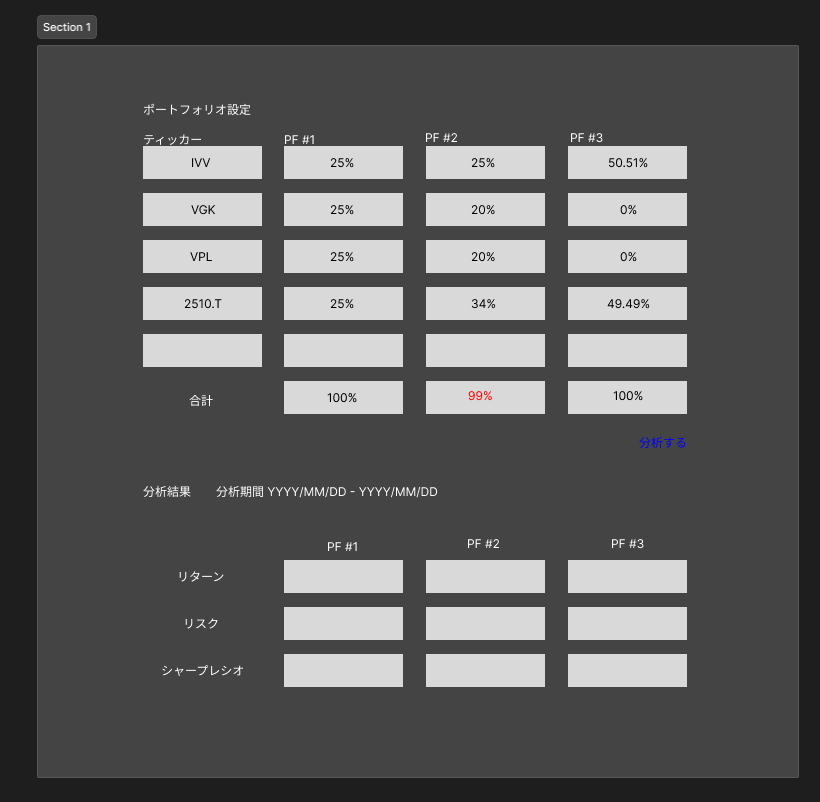

# 画面設計書

- [画面設計書](#画面設計書)
  - [画面概要説明](#画面概要説明)
  - [画面レイアウト](#画面レイアウト)
  - [画面項目定義](#画面項目定義)
  - [画面項目属性定義](#画面項目属性定義)
  - [画面項目入力チェック・バリデーション定義](#画面項目入力チェックバリデーション定義)
  - [画面イベント一覧](#画面イベント一覧)
  - [画面編集仕様 (◯◯ イベント時)](#画面編集仕様--イベント時)
  - [画面更新仕様 (◯◯ イベント時)](#画面更新仕様--イベント時)
  - [エラーメッセージ一覧](#エラーメッセージ一覧)
  - [補足説明](#補足説明)

## 画面概要説明

## 画面レイアウト

分析するボタンと結果の間にエラーメッセージを表示する。

## 画面項目定義

| No. | 項目名               | 項目種別 | 項目ラベル ID       | タブ順 | I/O | データ型 | 表示タイミング     | 備考                                                                 |
| --- | -------------------- | -------- | ------------------- | ------ | --- | -------- | ------------------ | -------------------------------------------------------------------- |
| 1   | PF 設定              | text     | pf_config_label     | 1      | O   | String   | 初期               | PF: Portfolio                                                        |
| 2   | ティッカー           | text     | ticker_label        | 2      | O   | String   | 初期               |                                                                      |
| 3   | PF 番号              | text     | pf_number           | 3      | O   | String   | 初期               | PF は 3 つまで．                                                     |
| 4   | ティッカープルダウン | pulldown | ticker_pulldown     | 4      | I   | list     | 初期               | ・検索付きプルダウン ・10 個くらいは追加出来るようにする          |
| 5   | ウェイト入力欄       | form     | weight_input        | 5      | I   | Float    | 初期               | ・0 ≦ w ≦ 100 ・最大文字数例 99.99                                |
| 6   | 合計ウェイト         | text     | total_weight_label  | 6      | O   | String   | 初期               |                                                                      |
| 7   | 合計ウェイト (計算)  | text     | total_weight_output | 7      | O   | Float    | ウェイト入力と同時 | 100 以外不可                                                         |
| 8   | PF 分析ボタン        | button   | pf_analysis_button  | 8      | I   | -        | 初期               | クリックするとリクエストが飛ぶ                                       |
| 9   | PF 分析結果          | text     | pf_analysis_result  | 9      | O   | String   | PF 分析後          |                                                                      |
| 10  | 分析期間             | text     | analysis_period     | 10     | O   | String   | PF 分析後          | 選択された銘柄の内、上場期間が短い物に合わせる。                     |
| 11  | PF 番号              | text     | pf_number_label     | 11     | O   | String   | PF 分析後          | 3 つまで                                                             |
| 12  | リターン             | text     | return_label        | 12     | O   | String   | PF 分析後          | CAGR                                                                 |
| 13  | リターン (出力)      | text     | return_output       | 13     | O   | Float    | PF 分析後          | ・% 表示 ・少数第 2 位まで                                        |
| 14  | リスク               | text     | risk_label          | 14     | O   | String   | PF 分析後          | 標準偏差を年率換算                                                   |
| 15  | リスク (出力)        | text     | risk_output         | 15     | O   | Float    | PF 分析後          | ・% 表示 ・少数第 2 位まで                                        |
| 16  | SR                   | text     | sr_label            | 16     | O   | String   | PF 分析後          | ・SR: Sharp Ratio ・リスクフリーレートは 0。 リターン ÷ リスク |
| 17  | SR (出力)            | text     | sr_output           | 17     | O   | Float    | PF 分析後          | ・% にしない ・少数第 2 位まで                                    |

注: PF: ポートフォリオ，SR: シャープレシオ，横位置と縦位置はデフォルトのままなので省略。

## 画面項目属性定義

| No. | 項目名               | 項目種別 | 文字種     | Format     | 必須 | 最小文字数 | 最大文字数 | 最小 Byte 数 | 最大 Byte 数 | 範囲最小値 | 範囲最大値 |
| --- | -------------------- | -------- | ---------- | ---------- | ---- | ---------- | ---------- | ------------ | ------------ | ---------- | ---------- |
| 1   | ティッカープルダウン | pulldown | 半角英数字 | 任意文字列 | 必須 | 1          | 6          | 1            | 6            | -          | -          |
| 2   | ウェイト入力欄       | form     | 半角数字   | 任意文字列 | 必須 | 1          | 5          | 1            | 5            | 0          | 100        |

## 画面項目入力チェック・バリデーション定義

| No. | チェック/バリデーション名 | 対象項目名           | 項目種別 | Client/Server | チェックタイミング      | エラー及びワーニング判定条件                | メッセージ ID           |
| --- | ------------------------- | -------------------- | -------- | ------------- | ----------------------- | ------------------------------------------- | ----------------------- |
| 1   | ウェイト入力欄 チェック   | ウェイト入力欄       | form     | Client        | ウェイト入力完了時      | 0 ≦ w ≦ 100                                 | MSG_INVALID_WEIGHTS     |
| 2   | 合計ウェイト チェック     | 合計ウェイト (出力)  | text     | Client        | ウェイト入力完了時      | w == 100                                    | MSG_INVALID_SUM_WEIGHTS |
| 3   | ティッカー入力チェック    | ティッカープルダウン | pulldown | Client        | PF 分析ボタンクリック時 | ティッカーが少なくとも 1 つ入力されているか | MSG_EMPTY_TICKERS       |
| 4   | ウェイト入力チェック      | PF 分析ボタン        | button   | Client        | PF 分析ボタンクリック時 | ・ティッカーかつウェイトが TRUE か          | MSG_EMPTY_WEIGHTS       |

合計ウェイトチェックはメッセージいらない．

## 画面イベント一覧

| No. | アクション名 | イベント名 | 対象項目名         | 項目種別 | イベントタイミング | イベント処理内容                                                |
| --- | ------------ | ---------- | ------------------ | -------- | ------------------ | --------------------------------------------------------------- |
| 2   | ウェイト入力 | onChange   | ウェイト入力欄     | text     | ウェイト入力変更時 | ・入力内容のバリデーションを実施 ・エラー時 MSG 表示         |
| 3   | ウェイト入力 | onBlur     | 合計ウェイト(出力) | text     | ウェイト入力終了時 | ・合計ウェイトの計算 ・バリデーション ・エラー時 MSG 表示 |
| 4   | PF 分析      | onClick    | PF 分析ボタン      | button   | ボタンクリック時   | ・入力内容のバリデーションを実施 ・エラー時は MSG 表示       |

## 画面編集仕様 (◯◯ イベント時)

| No. | 項目名        | 項目種別 | 取得元テーブル名／設定ファイル           | 取得元テーブル項目名／固定値 | 編集仕様                           |
| --- | ------------- | -------- | ---------------------------------------- | ---------------------------- | ---------------------------------- |
| 1   | PF 分析ボタン | button   | ・価格履歴テーブル ・配当履歴テーブル |                              | テーブルからリターンとリスクを計算 |

## 画面更新仕様 (◯◯ イベント時)

特に保存はしないので不要か

| No. | 項目名 | 項目種別 | 保存先テーブル名 | 保存先テーブル項目名 | 更新仕様 |
| --- | ------ | -------- | ---------------- | -------------------- | -------- |
|     |        |          |                  |                      |          |

## エラーメッセージ一覧

| メッセージ ID           | エラーメッセージ一覧                         |
| ----------------------- | -------------------------------------------- |
| MSG_INVALID_WEIGHTS     | 各ウェイトは 0 以上 100 以下にしてください。 |
| MSG_INVALID_SUM_WEIGHTS | ウェイトの合計は 100 にしてください。        |
| MSG_EMPTY_TICKERS       | ティッカーを入力してください。               |
| MSG_EMPTY_WEIGHTS       | ウェイトを入力してください。                 |

## 補足説明
