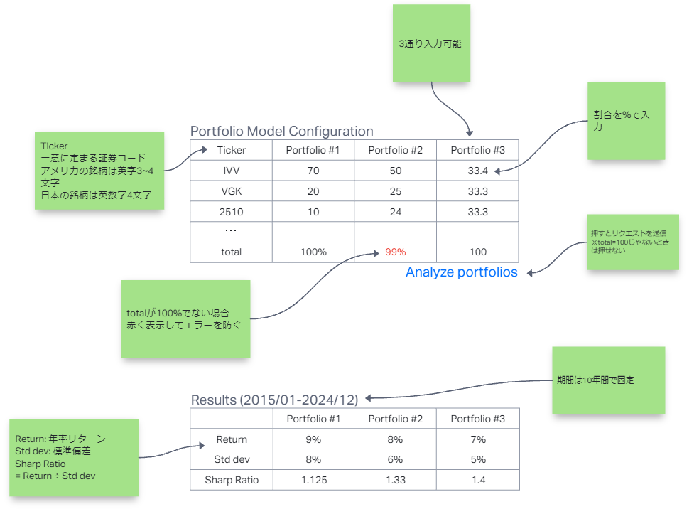

# 画面設計書

- [画面設計書](#画面設計書)
  - [画面概要説明](#画面概要説明)
  - [画面レイアウト](#画面レイアウト)
  - [画面項目定義](#画面項目定義)
  - [画面項目属性定義](#画面項目属性定義)
  - [画面項目入力チェック・バリデーション定義](#画面項目入力チェックバリデーション定義)
  - [画面イベント一覧](#画面イベント一覧)
  - [画面編集仕様 (◯◯ イベント時)](#画面編集仕様--イベント時)
  - [画面更新仕様 (◯◯ イベント時)](#画面更新仕様--イベント時)
  - [エラーメッセージ一覧](#エラーメッセージ一覧)
  - [補足説明](#補足説明)

## 画面概要説明

## 画面レイアウト

## 画面項目定義

| No. | 項目名                    | 項目種別 | 項目ラベル ID | タブ順 | I/O | データ型 | 表示タイミング     | 横位置 | 縦位置 | 備考                                                                                          |
| --- | ------------------------- | -------- | ------------- | ------ | --- | -------- | ------------------ | ------ | ------ | --------------------------------------------------------------------------------------------- |
|     | PF 定義 (入力欄ラベル)    | text     |               |        | O   | String   | 初期               |        |        | PF: Portfolio                                                                                 |
|     | ティッカー (入力欄ラベル) | text     |               |        | O   | String   | 初期               |        |        |                                                                                               |
|     | PF 番号 (入力欄ラベル)    | text     |               |        | O   | String   | 初期               |        |        | PF は 3 つまで．                                                                              |
|     | 日本チェックボックス      | checkbox |               |        | O   | Boolean  | 初期               |        |        | ・米国株との識別 ・`yfinance` で東証上場銘柄のティッカーの末尾に `.T` をつける処理のため。 |
|     | ティッカー入力欄          | form     |               |        | I   | String   | 初期               |        |        | ・英数 3 ~ 4 字 ・ティッカーは 10 行                                                       |
|     | ウェイト入力欄            | form     |               |        | I   | Float    | 初期               |        |        | ・0 ≦ w ≦ 100 ・空売り制約 ・レバレッジ制約                                             |
|     | 合計ウェイト (ラベル)     | text     |               |        | O   | String   | 初期               |        |        |                                                                                               |
|     | 合計ウェイト (出力)       | text     |               |        | O   | Float    | ウェイト入力と同時 |        |        | 100 以外不可                                                                                  |
|     | PF 分析ボタン             | button   |               |        | O   | -        | 初期               |        |        |                                                                                               |
|     | PF 分析結果               | text     |               |        | O   | String   | PF 分析後          |        |        |                                                                                               |
|     | 分析期間                  | text     |               |        | O   | String   | PF 分析後          |        |        | 選択された銘柄の内、上場期間が短い物に合わせる。                                              |
|     | PF 番号 (ラベル)          | text     |               |        | O   | String   | PF 分析後          |        |        | 3 つまで                                                                                      |
|     | リターン (ラベル)         | text     |               |        | O   | String   | PF 分析後          |        |        | CAGR                                                                                          |
|     | リターン (出力)           | text     |               |        | O   | Float    | PF 分析後          |        |        | ・% 表示 ・少数第 2 位まで                                                                 |
|     | リスク (ラベル)           | text     |               |        | O   | String   | PF 分析後          |        |        | 標準偏差を年率換算                                                                            |
|     | リスク (出力)             | text     |               |        | O   | Float    | PF 分析後          |        |        | ・% 表示 ・少数第 2 位まで                                                                 |
|     | SR (ラベル)               | text     |               |        | O   | String   | PF 分析後          |        |        | ・SR: Sharp Ratio ・リスクフリーレートは 0                                                 |
|     | SR (出力)                 | text     |               |        | O   | Float    | PF 分析後          |        |        | ・% にしない ・少数第 2 位まで                                                             |

注: PF: ポートフォリオ，SR: シャープレシオ

## 画面項目属性定義

| No. | 項目名                    | 項目種別 | 文字種     | Format     | 必須 | 最小文字数 | 最大文字数 | 最小 Byte 数 | 最大 Byte 数 | 範囲最小値 | 範囲最大値 |
| --- | ------------------------- | -------- | ---------- | ---------- | ---- | ---------- | ---------- | ------------ | ------------ | ---------- | ---------- |
|     | PF 定義 (入力欄ラベル)    | text     |            | 文字列     |      |            |            |              |              |            |            |
|     | ティッカー (入力欄ラベル) | text     |            | 文字列     |      |            |            |              |              |            |            |
|     | PF 番号 (入力欄ラベル)    | text     |            | 文字列     |      |            |            |              |              |            |            |
|     | 日本チェックボックス      | checkbox |            | N/A        |      |            |            |              |              |            |            |
|     | ティッカー入力欄          | form     | 半角英数字 | 任意文字列 | 必須 | 0          | 4          |              |              |            |            |
|     | ウェイト入力欄            | form     | 半角数字   | 任意文字列 | 必須 | 0          | 4          |              |              | 0          | 127        |
|     | 合計ウェイト (ラベル)     | text     |            | 文字列     |      |            |            |              |              |            |            |
|     | 合計ウェイト (出力)       | text     |            | 文字列     |      | 1          | 3          |              |              | 0          | 255        |
|     | PF 分析ボタン             | button   |            | N/A        |      |            |            |              |              |            |            |
|     | PF 分析結果               | text     |            | 文字列     |      |            |            |              |              |            |            |
|     | 分析期間                  | text     |            | 文字列     |      |            |            |              |              |            |            |
|     | PF 番号 (ラベル)          | text     |            | 文字列     |      |            |            |              |              |            |            |
|     | リターン (ラベル)         | text     |            | 文字列     |      |            |            |              |              |            |            |
|     | リターン (出力)           | text     |            | 文字列     |      | 1          | 7          |              |              | -1023      | 1023       |
|     | リスク (ラベル)           | text     |            | 文字列     |      |            |            |              |              |            |            |
|     | リスク (出力)             | text     |            | 文字列     |      | 1          | 5          |              |              | 0          | 127        |
|     | SR (ラベル)               | text     |            | 文字列     |      |            |            |              |              |            |            |
|     | SR (出力)                 | text     |            | 文字列     |      | 1          | 5          |              |              | -15        | 15         |

注: PF: ポートフォリオ，SR: シャープレシオ

## 画面項目入力チェック・バリデーション定義

| No. | チェック/バリデーション名 | 対象項目名    | 項目種別 | Client/Server | チェックタイミング      | エラー及びワーニング判定条件      | メッセージ ID           |
| --- | ------------------------- | ------------- | -------- | ------------- | ----------------------- | --------------------------------- | ----------------------- |
| 1   | ティッカー入力欄チェック  | ティッカー    | form     | Client        | ティッカー入力完了時    | ・半角 ・英数 ・3 or 4 文字 | MSG_INVALID_TICKERS     |
| 2   | ウェイト入力欄 チェック   | PF            | form     | Client        | ウェイト入力完了時      | 0 ≦ w ≦ 100                       | MSG_INVALID_WEIGHTS     |
| 3   | 合計ウェイト チェック     | 合計ウェイト  | text     | Client        | ウェイト入力完了時      | w = 100                           | MSG_INVALID_SUM_WEIGHTS |
| 4   | ティッカー入力チェック    | ティッカー    | form     | Client        | PF 分析ボタンクリック時 | ティッカーが入力されているか      | MSG_EMPTY_TICKERS       |
| 5   | ウェイト入力チェック      | PF            | form     | Client        | PF 分析ボタンクリック時 | ウェイトが入力されているか        | MSG_EMPTY_WEIGHTS       |
| 4   | 銘柄存在チェック          | PF 分析ボタン | Button   | Server        | PF 分析ボタンクリック時 | ・`yfinance` で銘柄が存在するか   | MSG_TICKERS_NOT_FOUND   |

## 画面イベント一覧

| No. | アクション名   | イベント名 | 対象項目名 | 項目種別 | イベントタイミング   | イベント処理内容                                                |
| --- | -------------- | ---------- | ---------- | -------- | -------------------- | --------------------------------------------------------------- |
| 1   | ティッカー入力 | onChange   |            | text     | ティッカー入力変更時 | ・入力内容のバリデーションを実施 ・エラー時 MSG 表示         |
| 2   | ウェイト入力   | onChange   |            | text     | ウェイト入力変更時   | ・入力内容のバリデーションを実施 ・エラー時 MSG 表示         |
| 3   | ウェイト入力   | onBlur     |            | text     | ウェイト入力終了時   | ・合計ウェイトの計算 ・バリデーション ・エラー時 MSG 表示 |
| 4   | PF 分析ボタン  | onClick    |            | button   | ボタンクリック時     | ・入力内容のバリデーションを実施 ・エラー時は MSG 表示       |

## 画面編集仕様 (◯◯ イベント時)

| No. | 項目名 | 項目種別 | 取得元テーブル名／設定ファイル | 取得元テーブル項目名／固定値 | 編集仕様 |
| --- | ------ | -------- | ------------------------------ | ---------------------------- | -------- |
|     |        |          |                                |                              |          |

## 画面更新仕様 (◯◯ イベント時)

| No. | 項目名 | 項目種別 | 保存先テーブル名 | 保存先テーブル項目名 | 更新仕様 |
| --- | ------ | -------- | ---------------- | -------------------- | -------- |
|     |        |          |                  |                      |          |

## エラーメッセージ一覧

| メッセージ ID          | エラーメッセージ一覧                         |
| ---------------------- | -------------------------------------------- |
| MSG_INVALID_TICKERS    | ティッカーを正しく入力してください。         |
| MSG_INVALID_WEIGHT     | 各ウェイトは 0 以上 100 以下にしてください。 |
| MSG_INVALID_SUM_WEIGHT | ウェイトの合計は 100 にしてください。        |
| MSG_TICKERS_NOT_FOUND  | 銘柄が見つかりませんでした。                 |

## 補足説明
